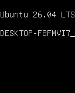

[**English**](README.md) | [**简体中文**](README.zh-CN.md)

# Linux DRM driver tutorial

> A minimal atomic KMS driver built as an out-of-tree module and run on WSL2 or
> under QEMU: write a pixel from userspace and watch the whole DRM data path,
> down to `drm_tutorial_plane_helper_atomic_update()`, in dmesg.

```
          pixel scanout path (left → right)

┌────────────┐──▶┌────────────┐──▶┌────────────┐──▶┌────────────┐──▶┌────────────┐──▶┌────────────┐
│  GEM DMA   │   │ framebuffer│   │   plane    │   │    CRTC    │   │  encoder   │   │ connector  │
│   pixels   │   │   RGB565   │   │ (primary)  │   │  128x160   │   │   no-op    │   │  128x160   │
└────────────┘   └────────────┘   └────────────┘   └────────────┘   └────────────┘   └────────────┘
```

Modes flow the other way: the connector's `get_modes` produces the 128x160 mode
and the CRTC validates it (`drm_crtc_helper_mode_valid_fixed`).

## TL;DR

- One C file (`drm.c`) registers a primary plane, CRTC, no-op encoder and
  virtual connector at a fixed **128x160 RGB565** mode, then exposes the
  pipeline as `/dev/fb0` through fbdev emulation (`drm_client_setup()`).
- A write to `/dev/fb0` lands in a shadow buffer, a workqueue blits the dirty
  rectangle into the GEM DMA buffer, `drm_atomic_helper_dirtyfb()` builds an
  atomic commit, and the driver's `atomic_update()` logs the damage rectangle
  plus the top-left 4x4 pixels.
- Design details live in [docs/](docs/README.md); the README only covers build
  and run.
- Offline checks (no hardware): `make check`. Hardware tests need the module
  loaded and `/dev/fb0` present; they report `ENVIRONMENT_ERROR` otherwise.

## Quick start

### Environment

|        |                                    |
| ------ | ---------------------------------- |
| Distro | WSL-Ubuntu 26.04                   |
| Kernel | 6.18.40.1-microsoft-standard-WSL2+ |

This is the environment the driver was developed and the sample logs below were
captured on. The WSL2 kernel sources
([WSL2-Linux-Kernel](https://github.com/microsoft/WSL2-Linux-Kernel.git)) are
used both for building the module and for resolving kernel panics; they are
referred to as `<kernel-src>` below.

### 1. Configure the kernel

The stock WSL2 kernel disables most DRM support, so it must be rebuilt with a
few options enabled first. The config file used by WSL lives at
`Microsoft/config-wsl` in the WSL2-Linux-Kernel tree, i.e.
`<kernel-src>/Microsoft/config-wsl`.

Enable the following options:

| Option | Why it is needed |
| ------ | ---------------- |
| `CONFIG_DRM=y` | DRM core |
| `CONFIG_DRM_KMS_HELPER=y` | atomic/KMS helpers used by the driver (`drm_atomic_helper_*`, `drm_crtc_helper_mode_valid_fixed`) |
| `CONFIG_DRM_GEM_DMA_HELPER=y` | GEM DMA buffers (`DEFINE_DRM_GEM_DMA_FOPS`, `drm_gem_dma_*`) |
| `CONFIG_DRM_FBDEV_EMULATION=y` | fbdev emulation (`DRM_FBDEV_DMA_DRIVER_OPS`) |
| `CONFIG_DRM_CLIENT_SETUP=y` | `drm_client_setup()` used at probe time (also requires `CONFIG_DRM_CLIENT=y`, `CONFIG_DRM_CLIENT_LIB=y`, and `CONFIG_DRM_CLIENT_DEFAULT="fbdev"`) |
| `CONFIG_FB=y` | framebuffer subsystem |
| `CONFIG_FB_DEVICE=y` | creates the `/dev/fb*` nodes and registers the fb char device (major 29) — **disabled in the stock config, must be enabled** |
| `CONFIG_DEVTMPFS=y` + `CONFIG_DEVTMPFS_MOUNT=y` | auto-creates `/dev/fb0` when fb0 is registered |
| `CONFIG_FRAMEBUFFER_CONSOLE=y` | optional: renders the kernel console (fbcon) on the virtual framebuffer, useful for testing |

> **`CONFIG_FB_DEVICE` is the critical one.** The stock `config-wsl` ships with
> `# CONFIG_FB_DEVICE is not set`. Without it the kernel still registers fb0
> (dmesg shows `[drm] fb0: drm_tutorialdrm frame buffer device` and fbcon can
> use it), but no `/sys/class/graphics/fb0` or `/dev/fb0` node is created and
> the fb char device is not registered — even a manual `mknod /dev/fb0 c 29 0`
> will not help. *(Verified on the environment above.)*

### 2. Build the module

```bash
make                 # builds drm-tutorial.ko against KDIR
make -C tests        # builds the framebuffer tests
make -C examples/drm # builds the raw DRM-ioctl demos
make check           # offline checks, no module or hardware required
```

`KDIR` defaults to `/lib/modules/$(uname -r)/build`; override it with
`make KDIR=/path/to/kernel/build`.

`make test` builds the module, reloads it with `rmmod`/`insmod` and dumps the
modeset state with `modetest -e`. It touches the running kernel — do not run it
on a machine you are not prepared to change.

### 3. Try it out

#### On WSL

```bash
fbgrab -d /dev/fb0 dump.png     # capture a screenshot
cp dump.png <windows-share>

./tools/fbview.py               # live preview of /dev/fb0
```

Example result - fbcon console text rendered on the virtual framebuffer:



#### Under QEMU

```bash
sudo apt install qemu-system-x86

cd <kernel-src>

# share a folder with the guest
mkdir qemu-share
cp /path/to/drm-tutorial.ko qemu-share/

# download a prebuilt Alpine initramfs
wget https://dl-cdn.alpinelinux.org/alpine/latest-stable/releases/x86_64/netboot/initramfs-virt

# boot the kernel together with the initramfs and the shared folder
sudo qemu-system-x86_64 \
  -kernel arch/x86/boot/bzImage \
  -initrd ./initramfs-virt \
  -append "console=ttyS0 root=/dev/ram init=/init" \
  -nographic \
  -virtfs local,path=$PWD/qemu-share,mount_tag=host0,security_model=none,id=host0 \
  -enable-kvm
```

Inside the guest, mount the shared folder and load the module:

```bash
mkdir -p /mnt/host
mount -t 9p -o trans=virtio host0 /mnt/host
cd /mnt/host
insmod drm-tutorial.ko
```

You should see the driver probe and fbcon switch to the virtual framebuffer.
The log below is an observation captured on the environment above; timestamps
and some ordering vary between runs.

```text
[   43.565783] drm_tutorial: loading out-of-tree module taints kernel.
[   43.567205] drm_tutorial_probe
[   43.568112] [drm] Initialized drm_tutorial 0.1.0 for drm_tutorial on minor 0
[   43.572990] drm_tutorial_plane_helper_atomic_check
[   43.572997] drm_tutorial_plane_helper_atomic_update, x1 : 0, y1 : 0, x2 : 128, y2 : 160
[   43.572998] drm_tutorial_crtc_helper_atomic_enable
[   43.573027] drm_tutorial_plane_helper_atomic_check
[   43.573032] drm_tutorial_plane_helper_atomic_update, x1 : 0, y1 : 0, x2 : 128, y2 : 160
[   43.573040] Console: switching to colour frame buffer device 16x20
[   43.573042] drm_tutorial_plane_helper_atomic_check
[   43.573043] drm_tutorial_plane_helper_atomic_update, x1 : 0, y1 : 0, x2 : 128, y2 : 160
[   43.574150] drm_tutorial_plane_helper_atomic_check
[   43.574154] drm_tutorial_plane_helper_atomic_update, x1 : 0, y1 : 0, x2 : 128, y2 : 160
[   43.589147] drm_tutorial drm_tutorial: [drm] fb0: drm_tutorialdrm frame buffer device
[   43.591768] DRM device registered
```

If kernel messages are quiet, raise the console log level:

```bash
echo "7 4 1 7" > /proc/sys/kernel/printk
```

## Documentation

The design documents are indexed in [docs/README.md](docs/README.md). Quick map:

| Document | Content |
| -------- | ------- |
| [drm-kms-concepts.md](docs/drm-kms-concepts.md) | DRM/KMS/GEM vocabulary and atomic modesetting |
| [driver-topology.md](docs/driver-topology.md) | the object graph this driver builds |
| [kms-objects.md](docs/kms-objects.md) | plane/CRTC/encoder/connector callbacks |
| [gem-dma-framebuffers.md](docs/gem-dma-framebuffers.md) | framebuffers, GEM DMA memory, the `dirty` hook |
| [module-load-and-probe.md](docs/module-load-and-probe.md) | `probe()` step by step |
| [fbdev-emulation.md](docs/fbdev-emulation.md) | `drm_client_setup()` → `/dev/fb0` |
| [fbdev-write-path.md](docs/fbdev-write-path.md) | a `/dev/fb0` write, end to end |
| [atomic-commit.md](docs/atomic-commit.md) | the commit machinery and `atomic_update()` |
| [driver-faq.md](docs/driver-faq.md) | common questions |
| [drm-ioctls.md](docs/drm-ioctls.md) | `modetest`, ioctl map, example programs |
| [kernel-source-map.md](docs/kernel-source-map.md) | which kernel file implements what |
| [kernel-debugging.md](docs/kernel-debugging.md) | resolving a panic RIP |

Each document has a Simplified Chinese mirror (`<name>.zh-CN.md`); the two must
stay content-equal. Knowledge-base conventions live in the workspace
[AGENTS.md](../AGENTS.md).

## License

GPL-2.0; see [LICENSE](LICENSE).
